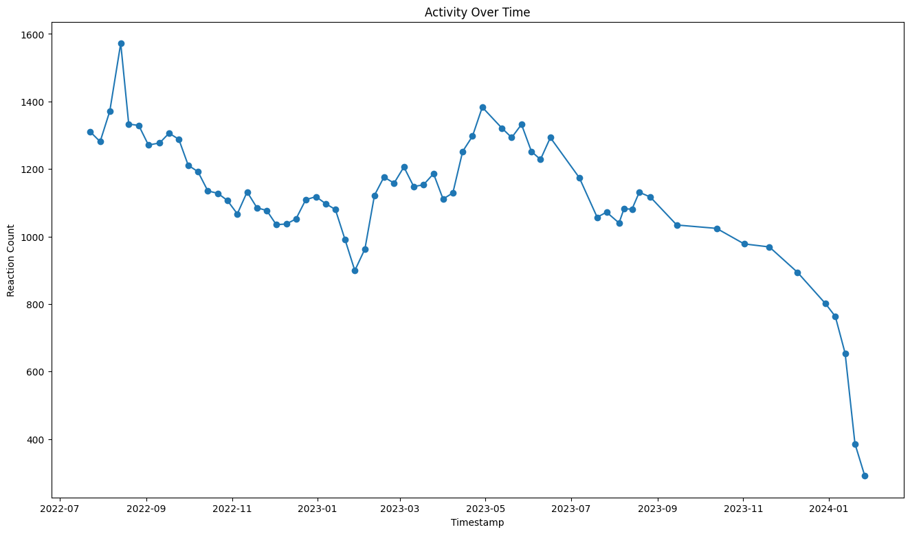
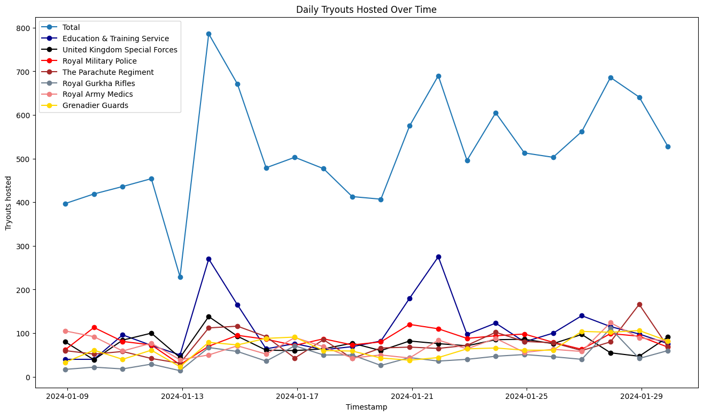
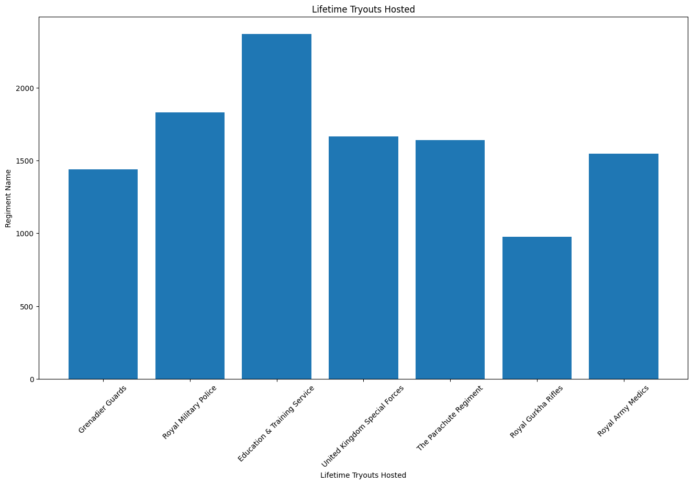

# UBA activity monitor

 

> A script that creates a line graph of activity in the UBA server

## Activity Over Time

### How does this work?

1. The discord.py file retrieves all the messages from the #activity channel on the Discord.
2. the timestamps and reaction count is extracted from all the *"Activity check posts*.
3. The script then generates a line graph with timestamps on the X-axis and reaction counts on the Y-axis
4. Then the graph is saved to the graph.png file.

### Example:

as of 22/01/2024

## Daily Tryouts Hosted Over Time

### How does this work?

1. The discord.py file retrieves all the messages from the #regimental channel on the Discord.
2. The main.py then searches all the *"Total Regimental Tryouts Hosted* posts for the amount of tryouts being hosted by each regiment and in total using regex. 
3. Each regiment is given its own line in the graph with an extra total line added for the total tryouts hosted in a day and time stamps are then put into a line graph with reactions as the Y axis and time stamp as the X axis.
4. the graph is then saved to the graph.png file.

### Example:

as of 30/01/2024

## Lifetime Tryouts Hosted

### How does this work?

1. The discord.py file retrieves all the messages from the #regimental channel on the Discord.
2. The main.py then searches all the *"Total Regimental Tryouts Hosted* posts for the amount of tryouts being hosted by each regiment using regex.
3. Each regiment is given its own individual bar in the bar graph.
4. the graph is then saved to the graph.png file.

### Example:

as of 30/01/2024

